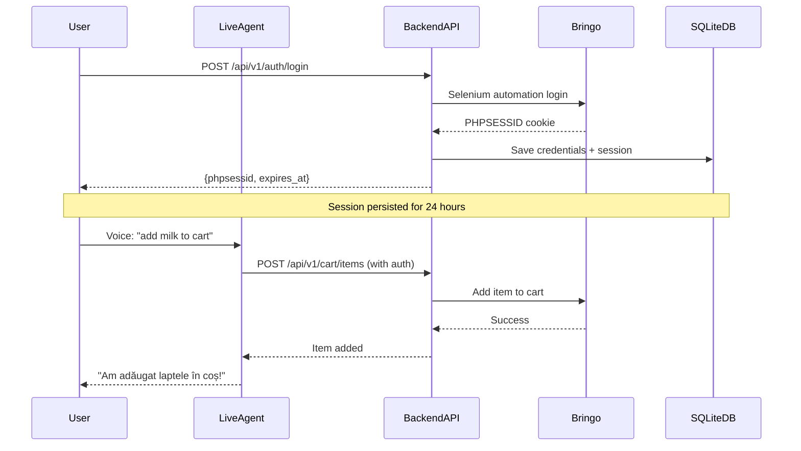

# 🧪 Test Plan: Bringo Multimodal Live Agent with Basket Adding

## Overview

Test the **Gemini Live AI Agent** (`shop-agent`) with complete shopping capabilities including:
- 🎤 **Voice interaction** using `gemini-live-2.5-flash-native-audio`
- 🔍 **Product search** using vector search + semantic ranking
- 🛒 **Basket management** (add items to cart)
- 🔐 **Authentication** with Bringo account

---

## Architecture Components

### 1. **Backend API** (Port 8080)
- **Base URL**: `http://34.78.177.35/api/v1`
- **API Key**: `bringo_secure_shield_2026`
- **Endpoints**:
  - `/api/v1/auth/login` - Authenticate with Bringo
  - `/api/v1/auth/status` - Check current session
  - `/api/v1/cart` - View cart summary
  - `/api/v1/cart/items` - Add items to cart
  - `/api/v1/search` - Product similarity search
  - `/api/v1/search/live` - Multi-store product search

### 2. **Live AI Agent** (Port 8000)
- **Location**: `/ai_agents/bringo-multimodal-live/agent/shop-agent`
- **Agent**: `gemini-live-2.5-flash-native-audio` with multimodal capabilities
- **Tools**:
  - `research_agent` - Market intelligence with Google Search
  - `find_shopping_items` - Product search using backend API
- **Language**: Romanian (native)

### 3. **Authentication Flow**


---

## 🔧 Pre-requisites

### 1. **Bringo Account Credentials**

You need valid Bringo account credentials. These can be configured in two ways:

**Option A: Environment Variables** (Recommended for testing)
```bash
# In ai_agents/bringo-multimodal-live/.env or config/settings.py
export BRINGO_USERNAME="your-email@example.com"
export BRINGO_PASSWORD="your-password"
export BRINGO_STORE="carrefour_park_lake"
```

**Option B: Login via API** (Persists to SQLite)
```bash
curl -X POST http://localhost:8080/api/v1/auth/login \
  -H "Content-Type: application/json" \
  -d '{
    "username": "your-email@example.com",
    "password": "your-password",
    "store": "carrefour_park_lake"
  }'
```

### 2. **Required Dependencies**

```bash
cd /Users/radanpetrica/PFA/agents/agents-adk-mcp/ai_agents/bringo-multimodal-live/agent/shop-agent
make install
```

### 3. **GCP Authentication**

```bash
gcloud auth application-default login
gcloud config set project formare-ai
```

---

## 🚀 Test Execution

### Test 1: Start Backend API

**Objective**: Verify that the backend API is running and authentication works

```bash
# Terminal 1: Start the backend API
cd /Users/radanpetrica/PFA/agents/agents-adk-mcp/ai_agents/bringo-multimodal-live
python -m api.main
```

**Expected Output**:
```
🚀 Starting Bringo Product Similarity API...
🔧 Configuration:
   • Env: Production Mode
   • Host: 0.0.0.0:8080
   • Model: multimodalembedding@001 (512D)
   • Ranking: semantic-ranker-default@latest
INFO:     Application startup complete.
```

**Test Authentication**:
```bash
# Terminal 2: Test login endpoint
curl -X POST http://localhost:8080/api/v1/auth/login \
  -H "Content-Type: application/json" \
  -d '{
    "username": "YOUR_EMAIL",
    "password": "YOUR_PASSWORD",
    "store": "carrefour_park_lake"
  }'
```

**Expected Response**:
```json
{
  "status": "success",
  "message": "Authentication successful",
  "username": "your-email@example.com",
  "phpsessid": "abc123...",
  "expires_at": "2026-01-31T19:00:00"
}
```

**Verify Session Persistence**:
```bash
curl http://localhost:8080/api/v1/auth/status
```

✅ **Pass Criteria**: 
- API starts without errors
- Login returns `status: "success"` and `phpsessid`
- Status check shows `"authenticated"` after successful login

---

### Test 2: Start Live AI Agent

**Objective**: Launch the Gemini Live AI agent with integrated frontend

```bash
# Terminal 3: Start the Live AI Agent
cd /Users/radanpetrica/PFA/agents/agents-adk-mcp/ai_agents/bringo-multimodal-live/agent/shop-agent
make local-backend
```

**Expected Output**:
```
INFO:     Uvicorn running on http://0.0.0.0:8000 (Press CTRL+C to quit)
INFO:     Started reloader process using WatchFiles
INFO:     Started server process
INFO:     Waiting for application startup.
INFO:     Application startup complete.
```

**Access the Frontend**:
1. Open browser: `http://localhost:8000`
2. Click the **Play button** to start voice interaction
3. Grant microphone permissions

✅ **Pass Criteria**:
- Frontend loads successfully
- Play button is clickable
- Microphone connects without errors

---

### Test 3: Voice Product Search

**Objective**: Test the agent's ability to search for products using voice

**Test Cases**:

#### 3.1 Simple Product Search (Romanian)
**Voice Input**: *"Caut lapte"* (I'm looking for milk)

**Expected Agent Behavior**:
1. Agent calls `find_shopping_items(["lapte"])`
2. Backend API performs vector search + ranking
3. Agent responds in Romanian with product matches

**Expected Response** (approximate):
```
"Am găsit produsele potrivite pentru tine! 
Iată cele mai relevante opțiuni de lapte..."

<gallery>
[
  {
    "product_name": "Lapte proaspăt integral...",
    "ranking_score": 0.92,
    "price": "7.99 RON",
    ...
  }
]
</gallery>
```

#### 3.2 Complex Shopping Intent
**Voice Input**: *"Am nevoie de ingrediente pentru un mic dejun sănătos"*

**Expected Agent Behavior**:
1. Agent delegates to `research_agent` for query optimization
2. Research agent generates 5 diverse queries
3. Agent calls `find_shopping_items` with optimized queries
4. Returns curated product selection

**Expected Output**:
- Multiple product categories (oats, fruits, yogurt, honey, etc.)
- High ranking scores (>0.80)
- Romanian product names and descriptions

#### 3.3 Visual Search (Upload Image)
**Action**: Upload a product image

**Expected Agent Behavior**:
1. Agent processes image through multimodal embedding
2. Calls `find_shopping_items` with visual query
3. Returns visually similar products

✅ **Pass Criteria**:
- Agent responds in Romanian
- Product search completes in <5 seconds
- Results show `ranking_score` values
- Products are relevant to the query

---

### Test 4: Add Items to Cart

**Objective**: Test the complete shopping workflow including cart management

**Pre-requisite**: Ensure authenticated session from Test 1

#### 4.1 Add Single Item

**Step 1**: Search for a product
```
Voice: "Caută lapte Zuzu"
```

**Step 2**: Ask to add to cart
```
Voice: "Adaugă primul produs în coș"
```

**Expected Agent Behavior**:
1. Agent extracts product details from search results
2. Makes authenticated request to `/api/v1/cart/items`:
   ```json
   {
     "product_id": "...",
     "product_url": "...",
     "quantity": 1,
     "product_name": "Lapte Zuzu..."
   }
   ```
3. Backend uses stored PHPSESSID to add item to Bringo cart
4. Agent confirms in Romanian

**Expected Response**:
```
"Am adăugat laptele Zuzu în coșul tău! 
Doriți să adăugați alte produse?"
```

#### 4.2 Check Cart Status

**Voice Input**: *"Ce am în coș?"*

**Expected Backend Call**: `GET /api/v1/cart`

**Expected Response**:
```json
{
  "status": "success",
  "message": "Cart summary retrieved",
  "cart_count": 1
}
```

#### 4.3 Add Multiple Items

**Voice Workflow**:
```
1. "Caut ingrediente pentru salată"
2. Agent shows multiple products
3. "Adaugă roșii, castraveți și ulei de măsline"
4. Agent adds 3 items sequentially
```

✅ **Pass Criteria**:
- Cart operations complete successfully
- Items appear in actual Bringo cart (verify at www.bringo.ro)
- Agent provides confirmation in Romanian
- No authentication errors

---

### Test 5: Error Handling

**Objective**: Verify graceful error handling

#### 5.1 Expired Session
**Setup**: Wait 24 hours or manually clear database session

**Voice Input**: *"Adaugă apă în coș"*

**Expected Behavior**:
- Agent attempts cart operation
- Receives 401 Unauthorized
- Agent responds: *"Sesiunea ta a expirat. Te rog să te autentifici din nou."*

#### 5.2 Out of Stock Product
**Voice Input**: *"Adaugă [unavailable product] în coș"*

**Expected Behavior**:
- Agent searches with `in_stock_only: true`
- Returns only available products
- Or suggests alternatives

#### 5.3 Network Errors
**Setup**: Temporarily stop backend API

**Expected Behavior**:
- Agent handles connection errors gracefully
- Responds: *"Nu pot accesa catalogul în acest moment. Te rog încearcă din nou."*

✅ **Pass Criteria**:
- No crashes or unhandled exceptions
- User-friendly error messages in Romanian
- Proper logging of errors

---

### Test 6: Multi-Store Search

**Objective**: Test advanced search across multiple stores

**API Test**:
```bash
curl -X POST http://localhost:8080/api/v1/search/live \
  -H "Content-Type: application/json" \
  -d '{
    "queries": ["lapte", "pâine"],
    "address": "Bd. Theodor Pallady 51, București"
  }'
```

**Expected Behavior**:
1. Backend scrapes available stores at address
2. Searches products across top 5 stores
3. Returns aggregated results with price comparison

**Voice Input**: *"Caută laptele cel mai ieftin în zona mea"*

✅ **Pass Criteria**:
- Multi-store search completes
- Results include store information
- Price comparison is accurate

---

## 📊 Success Metrics

| Metric | Target | Status |
|--------|--------|--------|
| Authentication Success Rate | >95% | ⬜ |
| Product Search Latency | <3s | ⬜ |
| Cart Add Success Rate | >90% | ⬜ |
| Voice Recognition Accuracy | >85% | ⬜ |
| Session Persistence | 24 hours | ⬜ |
| Error Handling | No crashes | ⬜ |

---

## 🐛 Troubleshooting

### Issue: "Credentials not found"
**Solution**: Set `BRINGO_USERNAME` and `BRINGO_PASSWORD` in environment or login via API

### Issue: "Session expired"
**Solution**: Re-authenticate using `/api/v1/auth/login`

### Issue: "Product not found"
**Solution**: Verify product exists in BigQuery table `bringo_products_data.bringo_products_native`

### Issue: Agent doesn't respond to voice
**Solution**:
1. Check microphone permissions
2. Verify Gemini Live API key is configured
3. Check browser console for WebSocket errors

### Issue: Cart operations fail
**Solution**:
1. Verify PHPSESSID is valid: `GET /api/v1/auth/status`
2. Check Selenium ChromeDriver is installed
3. Verify network connectivity to www.bringo.ro

---

## 📝 Test Log Template

```markdown
## Test Execution: [DATE]

### Test 1: Backend API
- ✅/❌ API started successfully
- ✅/❌ Authentication successful
- Notes: ___

### Test 2: Live Agent
- ✅/❌ Frontend loaded
- ✅/❌ Voice connection established
- Notes: ___

### Test 3: Product Search
- ✅/❌ Simple search (Romanian)
- ✅/❌ Complex intent
- ✅/❌ Visual search
- Notes: ___

### Test 4: Cart Operations
- ✅/❌ Add single item
- ✅/❌ Check cart status
- ✅/❌ Add multiple items
- Notes: ___

### Test 5: Error Handling
- ✅/❌ Expired session
- ✅/❌ Out of stock
- ✅/❌ Network errors
- Notes: ___

### Overall Status: PASS/FAIL
```

---

## 🔐 Security Notes

1. **Never commit credentials** to version control
2. **Session cookies** are stored in SQLite database (`services/db.py`)
3. **API Key** (`bringo_secure_shield_2026`) protects backend endpoints
4. **PHPSESSID** expires after 24 hours
5. **Selenium** runs in headless mode for security

---

## 📚 Related Documentation

- [README.md](README.md) - Project overview
- [agent/shop-agent/README.md](agent/shop-agent/README.md) - Live agent setup
- [IMPLEMENTATION_GUIDE.md](IMPLEMENTATION_GUIDE.md) - Technical details
- [BEST_PRACTICES_GUIDE.md](BEST_PRACTICES_GUIDE.md) - Vector search optimization

---

## 🎯 Next Steps

After successful testing:

1. **Deploy to Production**
   ```bash
   cd agent/shop-agent
   make deploy
   ```

2. **Monitor Performance**
   - Cloud Trace for agent telemetry
   - BigQuery logs for LLM interactions
   - GCS for prompt-response logging

3. **Scale Configuration**
   - Increase Vector Search replicas (1-2 → 2-4)
   - Add rate limiting for cart operations
   - Implement caching for frequent searches

---

**Test Plan Version**: 1.0  
**Last Updated**: 2026-01-30  
**Created By**: Gemini AI Assistant
